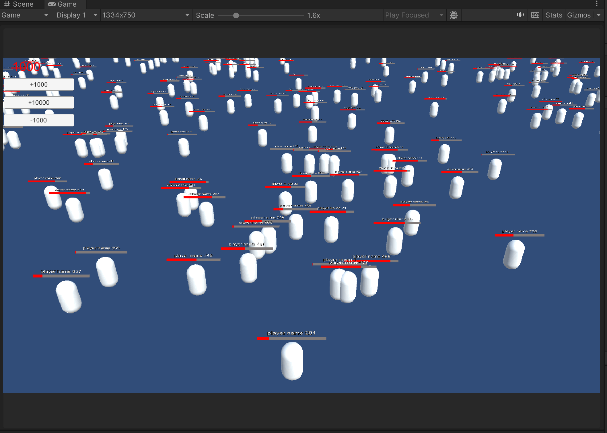
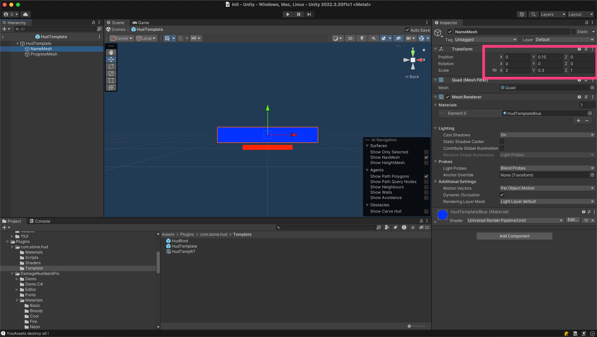
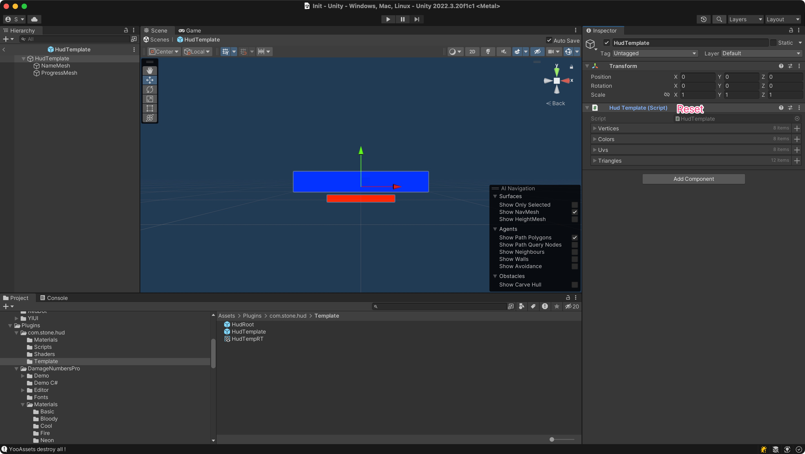
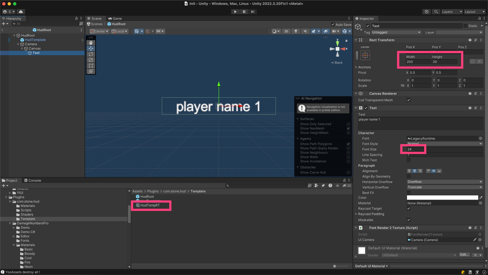

在游戏开发中若碰到需在场景中显示大量的名字和血条时，使用UI会带来3个性能问题。
1. DrawCall不可控
2. RebuildMesh带来的CPU负担
3. 沉重的GameObject实体开销

故使用GPU Instancing的方式渲染，且做了以下2个优化：
1. 使用Graphics.DrawMeshInstancedIndirect规避1023的限制。
2. 使用ComputeShader剔除摄像机视椎外的实例进一步提高性能。

# 如何使用
1. 把Template/HUDRoot拖入场景中
2. 添加HUD：HudRenderer.Instance.AddInstance`返回实例ID，进度取值0~1`
3. 移除HUD：HudRenderer.Instance.RemoveInstance
4. 更新进度：HudRenderer.Instance.SetInstanceProgress`进度取值0~1`
5. 更新位置：HudRenderer.Instance.SetInstancePosition`Update跟随`

# 性能测试
- 1000个和10000个HUD实例，性能上没有差别。
- 在低端设备20万HUD实例依旧拥有良好性能表现`稳定30帧，可见不是极限`。

- 摄像机视椎剔除使用ComputeShader

- 胶囊体的血条 实际效果

# 模版个性化
为方便使用，提供了一个模版，开发者可以根据自己的需求修改模版，模版本身不会被运行时使用。
### 模版调整方法如下：
- 1. 修改NameMesh和ProgressMesh的Position和Scale确定各自大小和位置

- 2. HudTemplate组件的Reset生成Mesh所用到的参数

- 3. 根据模版的大小设置HudTempRT的宽高`方便预览效果，运行时不使用`
- 4. 设置Text的宽高`重要，运行时自动创建Texture2DArray会使用该宽高`
- 5. 调整字体大小使之可以在HudTempRT中显示`可以调整使用其他字体组件如：TextMeshPro`

# 批量渲染带来的限制
渲染重叠的半透物体会闪烁，比如：字体的平滑边缘是半透的，会引起闪烁
此时有2种解决方案
1. 给字体图加一个不透明的背景 
2. 使用clip按透明度裁剪，字体此时有锯齿状描边，后续启用抗锯齿弱化